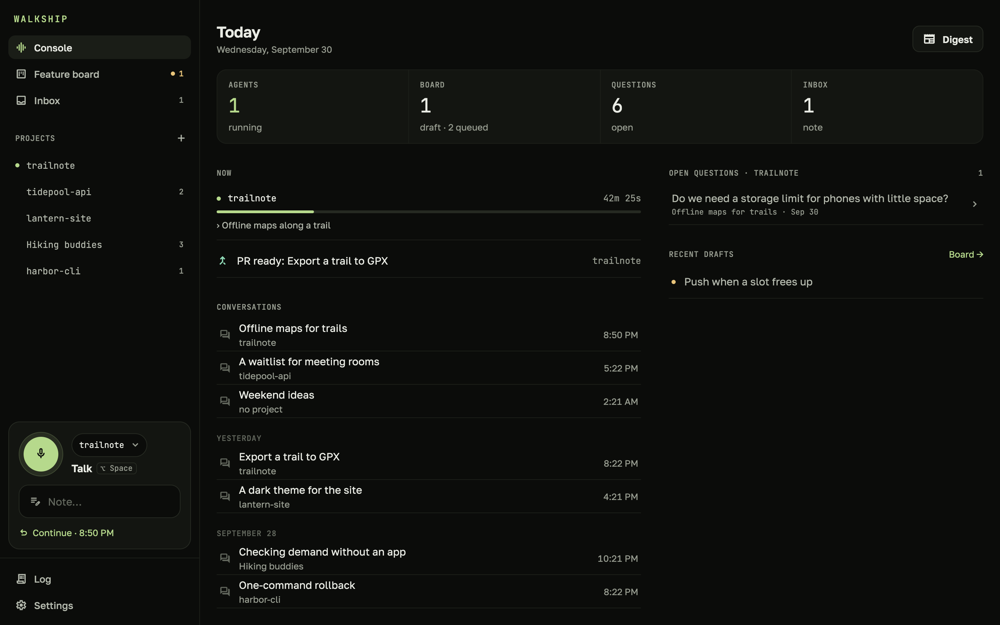
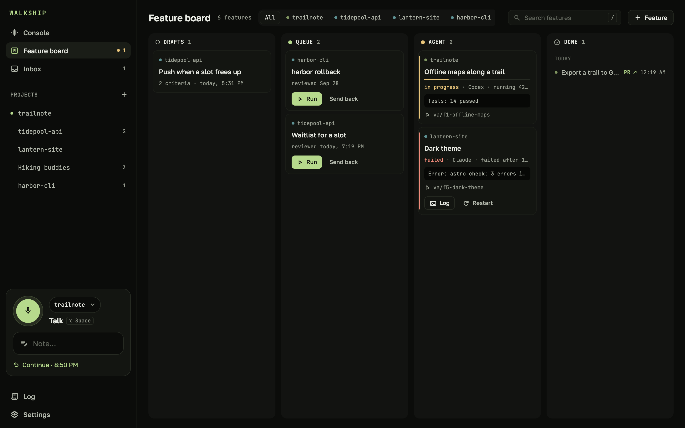
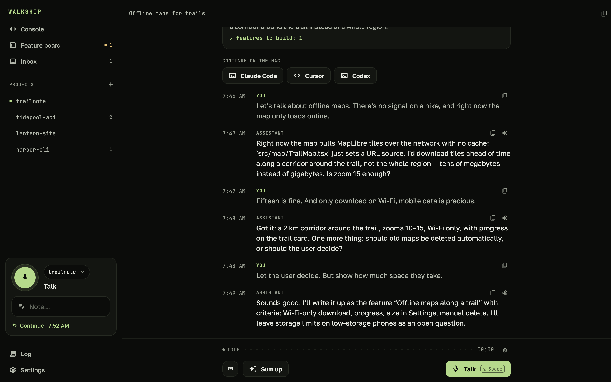
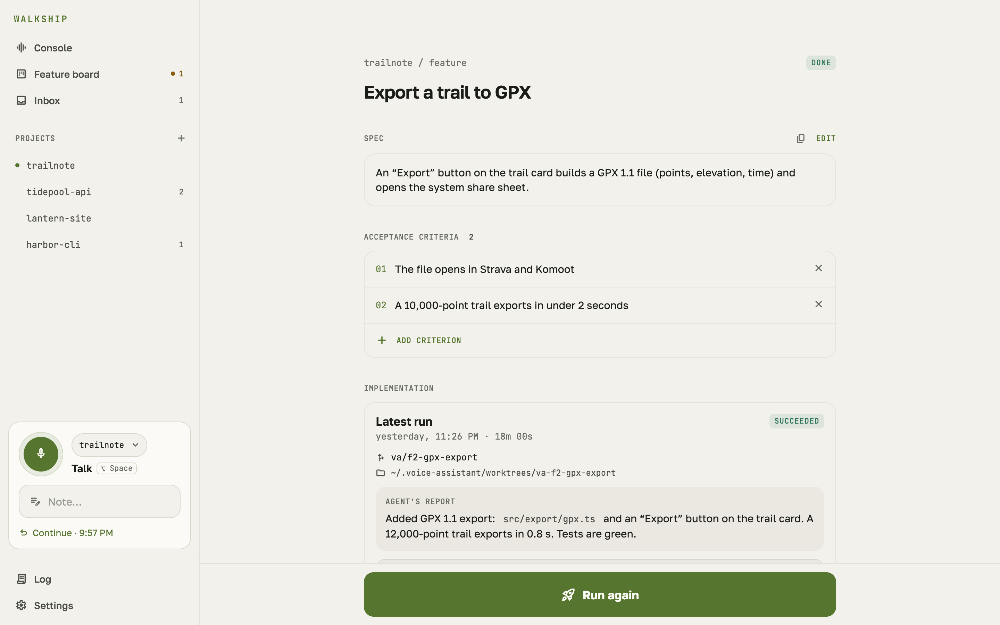
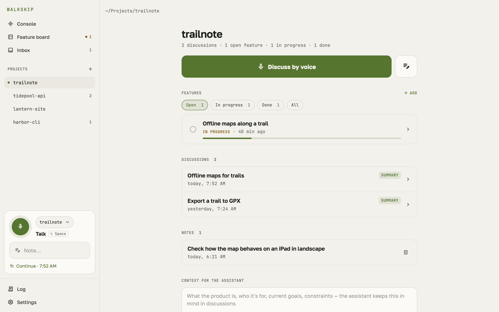

  <picture>
    <source media="(prefers-color-scheme: dark)" srcset="press/logo/walkship-horizontal-on-dark.svg">
    
  </picture>

<b>Go for a walk. Come back to a PR.</b>

  <a href="https://github.com/ilyabazhenov/walkship/releases/latest"><b>Download</b></a> ·
  <a href="https://ilyabazhenov.github.io/walkship/">Website</a> ·
  <a href="README.ru.md">По-русски</a>

  <picture>
    <source media="(prefers-color-scheme: light)" srcset="press/screenshots/en/mac-home-light.png">
    
  </picture>

Walkship is a voice partner for your projects. Talk a feature or a new product idea through while you walk: the assistant knows your
code, its git history and your past discussions. It turns the conversation into decisions, open questions and
features with acceptance criteria. One tap, and your coding agent — Claude Code or Codex — builds the feature on its
own branch on your Mac, runs the checks and sends a push to your phone. Talk the result over, say "open it", and the pull request is up.

> **Beta.** Walkship speaks English and Russian — one setting for the screens, the assistant and the voice.

## How it works

1. **You talk.** Hands-free: speak, pause, and the assistant answers out loud, then listens again.
2. **It sums up.** Say "wrap it up", and the conversation becomes a spec with acceptance criteria.
3. **An agent ships it.** Claude Code or Codex builds the feature in a separate git worktree and commits.
   You get a push, a spoken recap, and a PR when you say so.

Also: quick voice notes filed under the right project, a feature board across all projects, memory of past
discussions, a spoken digest, mockups in the conversation, one-click hand-off to Claude Code, Cursor or Codex,
an MCP server for your coding agents, and an offline outbox on the phone.

**Before the code.** A project can start without a repository: a product idea you talk over across several walks,
with memory and summaries that keep to-dos instead of features. When the repository exists, "Connect code" attaches
it, and the to-dos can go to an agent. Presets also cover a trip, a renovation, a move or an event.

**When the Mac is out of reach.** The phone can go on talking through a model with your own API key (DeepSeek or
any OpenAI-style API), remembering what the Mac knew about the project; once the Mac is back, everything moves over.

## Runs on your Mac

Walkship has no cloud and no accounts. The server, the database, speech recognition (Whisper) and the neural voices
run on your Mac. The conversation, summaries and code run on the local Claude Code or Codex CLI — your pick for each
— all under your own login and subscription, no API keys. The phone pairs with the Mac by QR code over your home network or [Tailscale](https://tailscale.com).

## Install

**Requirements:** a Mac with Apple Silicon and macOS 14 or later · [Claude Code](https://claude.com/claude-code)
with a Claude subscription, or Codex with a ChatGPT subscription — one is enough · about 5 GB free · git, and `gh`
for pull requests.

1. Download `Walkship-<version>-arm64.dmg` from the [latest release](https://github.com/ilyabazhenov/walkship/releases/latest)
   and drag Walkship into Applications.
2. Open it. The setup screen walks you through signing in to Claude Code, choosing the projects folder and
   installing the voice pack (about 3.3 GB).
3. Optional, Android: install `Walkship-<version>.apk` from the same release and scan the QR code from the Mac's
   setup screen. Android asks to allow installing apps from your browser.
   To get new versions automatically, add Walkship to [Obtainium](https://obtainium.imranr.dev):
   [add](https://apps.obtainium.imranr.dev/redirect?r=obtainium://add/https://github.com/ilyabazhenov/walkship)
   (open this link on the phone) or paste `https://github.com/ilyabazhenov/walkship` into it.

The Mac app checks for updates and offers new versions from the menu bar; your data stays in `~/.voice-assistant`.

## Screenshots

| | |
|---|---|
|  |  |
|  |  |

More, in both themes and for the phone, in [`press/screenshots`](press/screenshots).

## Problems and feedback

[Open an issue](https://github.com/ilyabazhenov/walkship/issues). In the Mac app, **Help → Report a problem** saves a
zip with versions, status and the server log to your Desktop; conversation texts are included only if you tick the
box. Look it over before attaching it.

## This repository

It holds the releases, the website (`docs/`, served by GitHub Pages, built by `node site/build.mjs`) and the press
kit (`press/`). The app's source code is not public.
