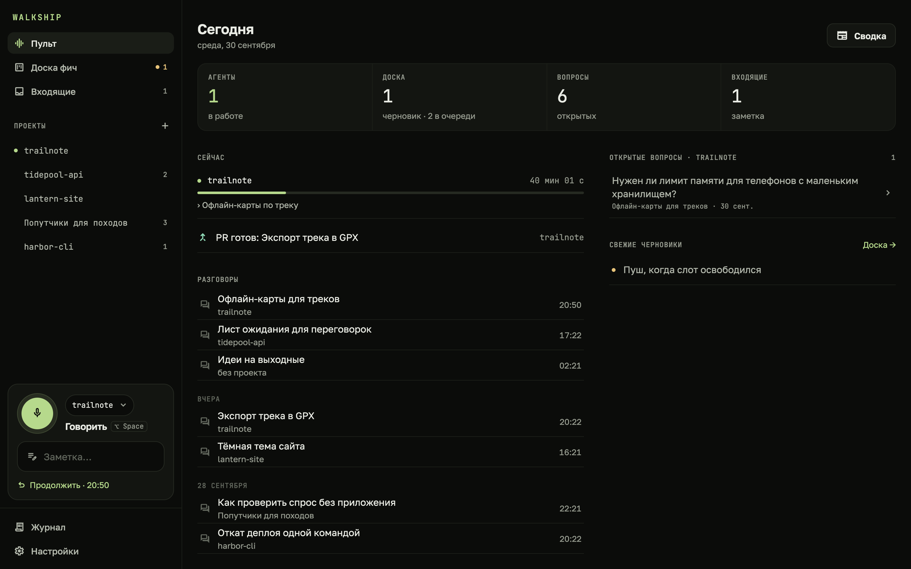
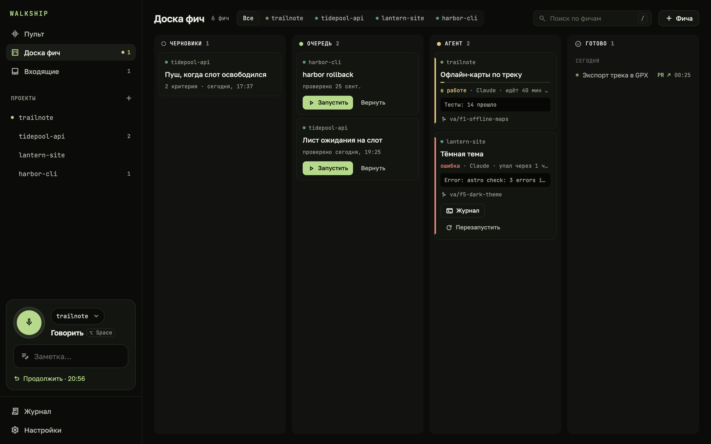
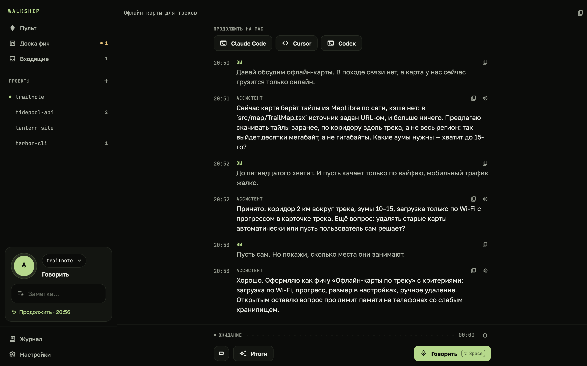
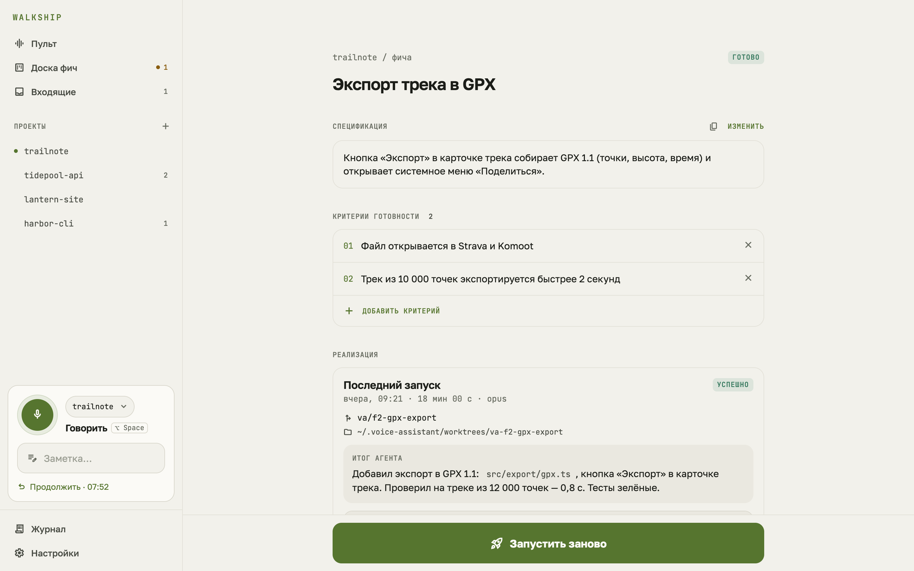
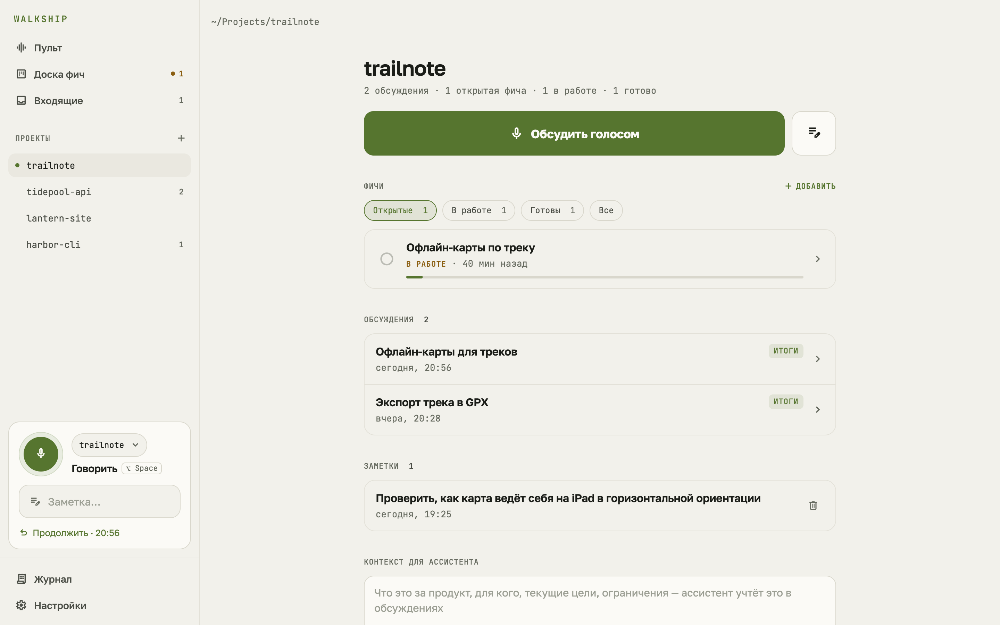

  <picture>
    <source media="(prefers-color-scheme: dark)" srcset="press/logo/walkship-horizontal-on-dark.svg">
    
  </picture>

<b>Ушёл гулять — вернулся к готовому PR.</b>

  <a href="https://github.com/ilyabazhenov/walkship/releases/latest"><b>Скачать</b></a> ·
  <a href="https://ilyabazhenov.github.io/walkship/ru/">Сайт</a> ·
  <a href="README.md">English</a>

  <picture>
    <source media="(prefers-color-scheme: light)" srcset="press/screenshots/ru/mac-home-light.png">
    
  </picture>

Walkship — голосовой партнёр для твоих проектов. Обсуждаешь фичу на прогулке, а ассистент знает твой код, историю
git и прошлые обсуждения. Разговор превращается в решения, открытые вопросы и фичи с критериями готовности. Одно
нажатие — и твой агент, Claude Code или Codex, реализует фичу в отдельной ветке на твоём Mac, прогоняет проверки и присылает пуш на телефон.
Обсуждаешь результат голосом, говоришь «открывай» — и пул-реквест готов.

> **Бета.** Walkship говорит по-русски и по-английски — одна настройка для экранов, ассистента и голоса.

## Как это работает

1. **Говоришь.** Hands-free: говоришь, после паузы ассистент отвечает вслух и снова слушает.
2. **Он собирает итоги.** Скажи «оформляй» — разговор превращается в спецификацию с критериями готовности.
3. **Агент пишет код.** Claude Code или Codex реализует фичу в отдельном git worktree и коммитит. Тебе приходит
   пуш, пересказ голосом, а PR открывается по твоей команде.

А ещё: быстрые голосовые заметки, которые сами находят свой проект; доска фич по всем проектам; память о прошлых
обсуждениях; сводка голосом; макеты прямо в разговоре; передача в Claude Code, Cursor или Codex одним нажатием;
MCP-сервер для твоих агентов; фразы без связи не теряются.

## Всё на твоём Mac

У Walkship нет облака и аккаунтов. Сервер, база, распознавание речи (Whisper) и нейро-голоса работают на Mac.
Разговор идёт через локальный `claude` CLI, а код пишет Claude Code или Codex — всё под твоим логином и по твоей
подписке, ключи API не нужны.
Телефон подключается к Mac по QR-коду через домашнюю сеть или [Tailscale](https://tailscale.com).

## Установка

**Что нужно:** Mac с Apple Silicon и macOS 14 или новее · [Claude Code](https://claude.com/claude-code) с подпиской
Claude (на нём идёт разговор) · по желанию Codex с подпиской ChatGPT, чтобы код писал он · около 5 ГБ свободного
места · git, для пул-реквестов — `gh`.

1. Скачай `Walkship-<версия>-arm64.dmg` из [последнего релиза](https://github.com/ilyabazhenov/walkship/releases/latest)
   и перетащи Walkship в «Программы».
2. Открой его. Экран настройки проведёт через вход в Claude Code, выбор папки с проектами и установку голосового
   пакета (~3,3 ГБ).
3. По желанию, Android: установи `Walkship-<версия>.apk` из того же релиза и отсканируй QR-код с экрана настройки на
   Mac. Android попросит разрешить установку приложений из браузера.

Приложение на Mac само проверяет обновления и предлагает новую версию из строки меню. Данные остаются в
`~/.voice-assistant`.

## Скриншоты

| | |
|---|---|
|  |  |
|  |  |

Остальные — в обеих темах и для телефона — в [`press/screenshots`](press/screenshots).

## Проблемы и отзывы

[Создай issue](https://github.com/ilyabazhenov/walkship/issues). В приложении на Mac **Справка → Сообщить о проблеме**
сохраняет на Рабочий стол zip с версиями, состоянием и журналом сервера; тексты разговоров попадают туда, только если
поставить галочку. Посмотри его, прежде чем прикладывать.

## Этот репозиторий

Здесь релизы, сайт (`docs/`, GitHub Pages, собирается `node site/build.mjs`) и пресс-кит (`press/`). Исходный код
приложения не публичный.
